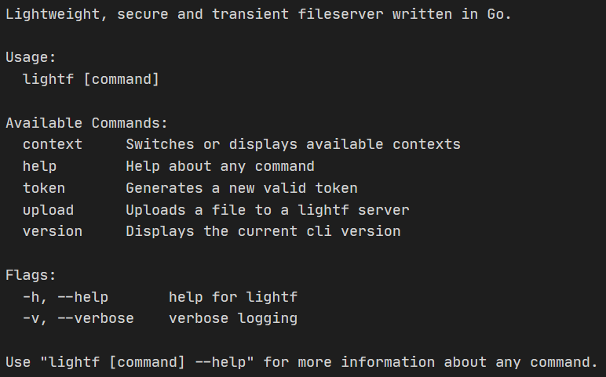

# lightf

**lightf** is a **light**weight, secure and transient **f**ileserver written in Go.

The main use-case is a simple, but powerful private fileserver to share files with your friend or colleagues. It also ships with a small cli tool.

## Features

- Authorization with tokens via a configuration file
  - Give access to specific friends with creating a token for them!
- Random names for uploaded files for security reasons
  - No more problems with counting IDs and people spying on your files!
- Allow only specific file types and sizes for specific access tokens
  - Maybe you want to share a token only for .png files? No problem!
- Expiration time for files
  - A must have. No chance for people saving the image id and downloading it later on.
- Additional cli tool for Unix based systems

## Setup

### Cli tool (optional)

First of all get your hands on the cli tool, as it will help creating secure tokens and uploading files. But of course, this tool is only **optional**, as you can create your own tokens as you like and upload files with `curl` for example.

Download the latest release on this Github page and unpack it to the folder of your liking.

Now copy the `lightf` binary to your bin folder and add execution permissions to it.

```bash
sudo cp ./lightf /usr/bin/lightf
sudo chmod +x /usr/bin/lightf
```

Try to execute

```bash
lightf --help
```

and you should see something like this in your terminal



If not, check if the binary folder you pasted the `lightf` file in is in your `$PATH`.

### Server

Most important is the `auth.yml` and the `storage` directory. The `auth.yml` will be used for authentication, i.e. allowing requests to upload files and the `storage` directory contains the `archive` and the current `files`, where the uploaded files will be stored.

For `auth.yml` configuration, see **below**.

After that, simply execute the `lightf-serv` binary, which you previously unpacked.

```bash
sudo chmod +x ./lightf-serv
./lightf-serv
```

And the server should be available at the default address `localhost:8081/upload`, which you can test with `curl` via

```bash
curl -X POST http://localhost:8081/upload
```

If you get a response, the server should be up and running.

### With Docker

With Docker, it is even more easy to setup the server. There is a prebuilt docker image available with the tag `superioz/lightf:latest`, which you can use.

Simply execute

```bash
docker run --rm superioz/lightf:latest
```

and you're good to go.

### With Docker-Compose

To take a step further, there is also a preconfigured `docker-compose.yml` file.

```yml
version: "3"

services:
    lightf:
        image: lightf:0.2.16
        environment: 
            LIGHTF_GIN_PORT: 8081
            LIGHTF_AUTH_CONF: /etc/lightf
            LIGHTF_STORAGE: /var/lib/lightf/storage
            LIGHTF_STORAGE_ADDRESS: "http://127.0.0.1:8080/%s"
        ports:
            - "8081:8081"
        volumes:
            - "./auth.yml:/etc/lightf/auth.yml:ro"
            - "./storage:/var/lib/lightf/storage"
    serve:
        image: halverneus/static-file-server:v1.7.2
        environment: 
            PORT: 8080
            FOLDER: /var/www
            SHOW_LISTING: "false"
        ports:
            - "8080:8080"
        volumes:
            - "./storage/files:/var/www"
```

Notice, that there is a static file server as well. This is only to show, how easily you can add a file server in front of the uploaded files.  
Btw: It is recommended to use HTTPS, but it is not neccessary.

Then simply run

```bash
docker-compose up
```

and bam, done.

## Configuration

### Cli Contexts

### General

### Authentication

## Environment Variables
